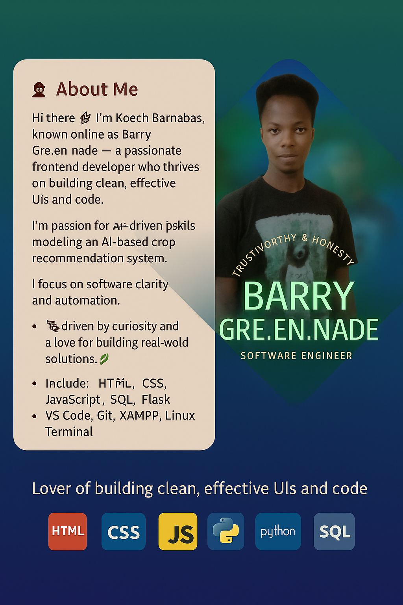

<!-- Profile Banner -->

  

<h1 align="center">Hi 👋, I'm Koech Barnabas</h1>

  

---

### 🔥 Résumé Article

  

<!-- Footer -->

  

---

### 🧑‍💻 About Me

<table>
<tr>
<td>

Hi there 👋 I'm **Koech Barnabas**, also known as **Barry Gre.en.nade** — a passionate Software Engineer who blends code with creativity to build smart, elegant digital solutions.

🌿 Currently thriving in frontend development, I'm expanding into full-stack with Python, Flask, and Django. My coding style focuses on clarity, functionality, and aesthetics.

💡 Whether it's crafting interactive UIs or solving real-world problems through automation and systems, I'm always chasing the next opportunity to **learn, create, and collaborate**.

🛠️ Tools I use:
- Languages: HTML, CSS, JavaScript, Python, SQL
- Frameworks: Flask, Django, Bootstrap
- Tools: VS Code, Git, XAMPP, Linux Terminal

🔍 Always curious. Forever building.  
📬 Let's connect: [@BarryKoech254 on Twitter](https://twitter.com/BarryKoech254)

> “Exploding Ideas into Green Solutions.” 💥🌱

</td>
<td align="center">
  
</td>
</tr>
</table>

---

### 🛠️ Tech Stack

---

### 📊 GitHub Insights

  
  

  

  

---

### 🌟 Projects Spotlight

| Project | Description | Tech |
|--------|-------------|------|
| 🌱 Crop Recommender | AI-based crop suggestion system | Python, Flask, HTML |
| 📲 Building & Construction | Company website | HTML, CSS, JS |
| 🔐 Cipher Analyzer | UI for Mono/Polyalphabetic ciphers | Flask, Python console|

---

### 🔗 Let's Connect

  
  
  

---

<!-- Footer -->

  

